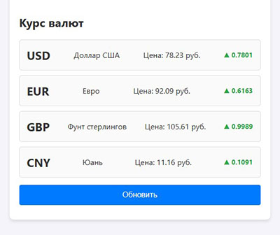

# Currency Tracker API

Проект для отслеживания курса валют с использованием JS, DOM и Fetch API.

- Использована деструктуризация объектов.
- Динамическое изменение стилей (классы CSS).

## Как запустить проект локально

1. Клонируйте репозиторий:
   `git clone https://github.com/lgalushka/currency-api-test.git`
2. Перейдите в папку проекта: `cd currency-api-test`
3. Откройте `index.html` через Live Server в VS Code.
